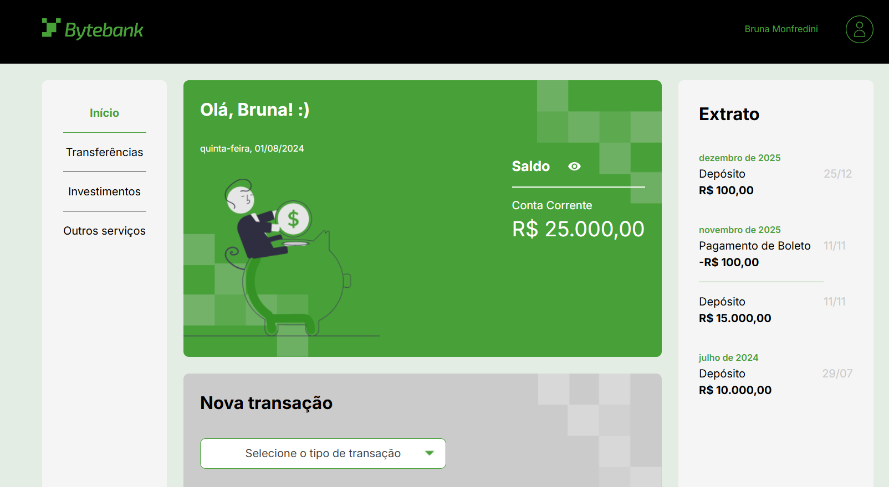

# Bitebank

O Meteora é uma loja de roupas. Atualmente, temos o código inicial de sua landing page, onde iremos atualizando conforme promoções.

## 🔨 Funcionalidades do projeto

Temos um projeto com uma apresentação de uma landing page de um banco, realizando simulações de depósito, transferências e pagamento de boleto. Saldo é atualizado conforme as transações.
Disponível para versões mobile, tablet e desktop.

## ✔️ Técnicas e tecnologias utilizadas

-`HTML` -`CSS` -`Javascript` -`Typescript` -`Acessibilidade Web`

## 🛠️ Abrir e rodar o projeto

Para abrir e rodar o projeto, utilize um editor de código de sua escolha.
Depois, abra o projeto no seu navegador.

## VERCEL

# Typescript: orientação a objetos

Este projeto faz parte da escola Front-end e tem como objetivo ensinar a transformar trechos de código originalmente cosntruídos em programação funcional para programação orientada a objetos, destacando as diferenças entre os dois paradigmas.

## Funcionalidades do projeto

O projeto contará com o desenvolvimento de:

- Classe conta e armazenador;
- Atributos e construtor de conta;
- Modificadores de acesso;
- Métodos estáticos;
- Herança de classes;
- Decorators de validação.
